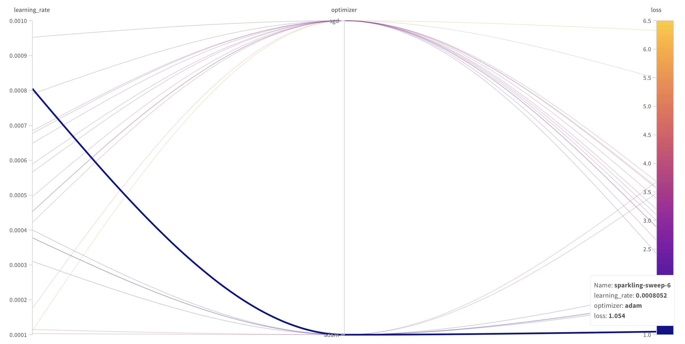
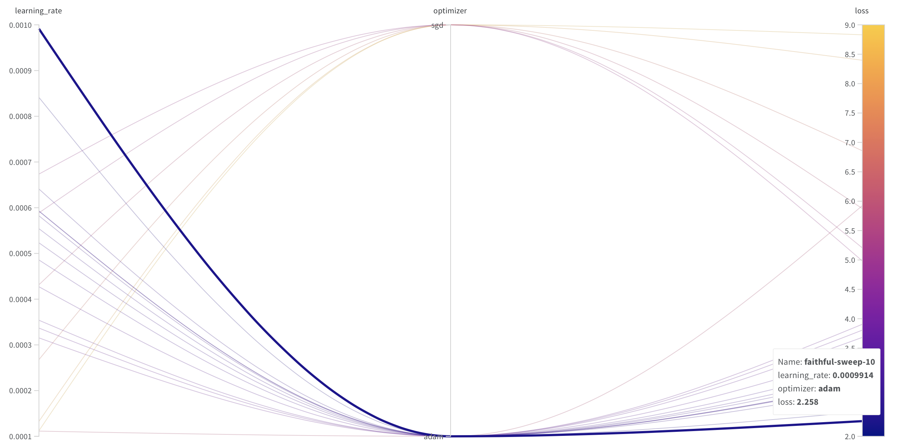

# Traffic-Sign-Recognition-Using-Transfer-Learning

Final Project for DS-UA 301 Advanced Topics in Data Science

### Team members
Lauren Kwon and Michelle Espinoza

## Project Description

Autonomous vehicles have recently emerged as a rising trend in artificial intelligence (AI) and deep learning (DL). Major car manufacturers such as Tesla, Toyota, Mercedes-Benz, and Ford are investing heavily in the development of self-driving car technology. Autonomous vehicles must understand and operate according to traffic rules. Consequently, cars must comprehend road markings and make appropriate decisions. Recognizing the importance of this technology, we attempt to classify traffic signs in this project.

One challenge faced in this project is the limited number of images per class in the dataset, which could lead to poor model performance. To overcome this issue, transfer learning will be employed. The approach involves using four pre-trained image classification models - ResNet-50, LeNet-5, DenseNet-161, and MobileNet v2 - to initialize the training and classification of the German Traffic Sign Recognition Benchmark dataset from Kaggle. Optimal learning rates are found using Weights & Biases.

Goal: Identifying the best model architecture and optimal learning rate when applying transfer learning for traffic sign recognition. 

## Model Architecture

The pre-trained model is first loaded, ensuring that the weights of all layers are frozen to preserve the original learned features. A new fully connected layer is then appended to the model, replacing the original one, with an output dimension of 43 corresponding to the number of traffic sign classes. The weights for newly added fully connected layer are initialized and the bias terms of the new layer are initialized to zero. During training, only the weights of the new fully connected layer will be updated, allowing the model to fine-tune its output for traffic sign classification while leveraging the knowledge encoded in the pre-trained architecture.

## Results

### Learning Rate

- ResNet-50

- LeNet-5

- DenseNet-161

- MobileNet v2

### Model Performance

- ResNet-50
<Train>
Epoch: 1/30	   Loss: 0.5769	 Accuracy: 83.36%
Epoch: 2/30	   Loss: 0.1054	 Accuracy: 97.11%
Epoch: 3/30	   Loss: 0.1271	 Accuracy: 96.94%
Epoch: 4/30	   Loss: 0.0655	 Accuracy: 98.31%
Epoch: 5/30	   Loss: 0.0413	 Accuracy: 98.91%
Epoch: 6/30	   Loss: 0.0493	 Accuracy: 98.76%
Epoch: 7/30	   Loss: 0.1158	 Accuracy: 97.55%
Epoch: 8/30	   Loss: 0.0591	 Accuracy: 98.66%
Epoch: 9/30	   Loss: 0.0336	 Accuracy: 99.21%
Epoch: 10/30	 Loss: 0.0701	 Accuracy: 98.13%
Epoch: 11/30	 Loss: 0.0147	 Accuracy: 99.58%
Epoch: 12/30	 Loss: 0.0619	 Accuracy: 98.24%
Epoch: 13/30	 Loss: 0.0470	 Accuracy: 98.75%
Epoch: 14/30	 Loss: 0.0462	 Accuracy: 99.02%
Epoch: 15/30	 Loss: 0.0190	 Accuracy: 99.61%
Epoch: 16/30	 Loss: 0.0127	 Accuracy: 99.64%
Epoch: 17/30	 Loss: 0.0164	 Accuracy: 99.56%
Epoch: 18/30	 Loss: 0.0297	 Accuracy: 99.28%
Epoch: 19/30	 Loss: 0.0125	 Accuracy: 99.72%
Epoch: 20/30	 Loss: 0.0193	 Accuracy: 99.47%
Epoch: 21/30	 Loss: 0.0251	 Accuracy: 99.37%
Epoch: 22/30	 Loss: 0.0196	 Accuracy: 99.60%
Epoch: 23/30	 Loss: 0.0426	 Accuracy: 98.94%
Epoch: 24/30	 Loss: 0.0172	 Accuracy: 99.57%
Epoch: 25/30	 Loss: 0.0115	 Accuracy: 99.74%
Epoch: 26/30	 Loss: 0.0125	 Accuracy: 99.72%
Epoch: 27/30	 Loss: 0.0176	 Accuracy: 99.52%
Epoch: 28/30	 Loss: 0.0125	 Accuracy: 99.66%
Epoch: 29/30	 Loss: 0.0215	 Accuracy: 99.43%
Epoch: 30/30	 Loss: 0.0301	 Accuracy: 99.44%

<Test> 
Accuracy: 0.42%

- LeNet-5
- DenseNet-161
- MobileNet v2
  
  
### Insights

## Conclusion

## References

- [German Traffic Sign Recognition Benchmark (GTSRB) Dataset from Kaggle](https://www.kaggle.com/datasets/meowmeowmeowmeowmeow/gtsrb-german-traffic-sign)
- [Traffic sign recognition with multi-scale Convolutional Networks (Sermanet and LeCun, 2011)](https://ieeexplore.ieee.org/document/6033589)
- He, K., Zhang, X., Ren, S., & Sun, J. (2016). Deep residual learning for image recognition. In Proceedings of the IEEE conference on computer vision and pattern recognition (pp. 770-778).
- Szegedy, C., Liu, W., Jia, Y., Sermanet, P., Reed, S., Anguelov, D., ... & Rabinovich, A. (2015). Going deeper with convolutions. In Proceedings of the IEEE conference on computer vision and pattern recognition (pp. 1-9).
- Huang, G., Liu, Z., Van Der Maaten, L., & Weinberger, K. Q. (2017). Densely connected convolutional networks. In Proceedings of the IEEE conference on computer vision and pattern recognition (pp. 4700-4708).
- Sandler, M., Howard, A., Zhu, M., Zhmoginov, A., & Chen, L. C. (2018). Mobilenetv2: Inverted residuals and linear bottlenecks. In Proceedings of the IEEE conference on computer vision and pattern recognition (pp. 4510-4520).
