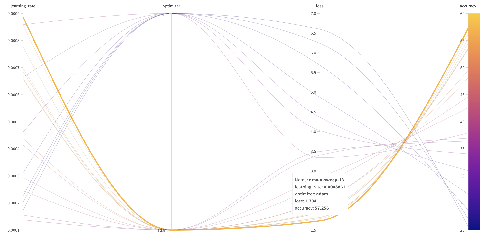
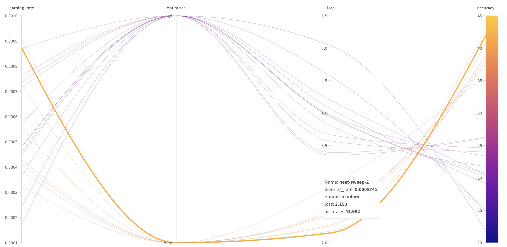
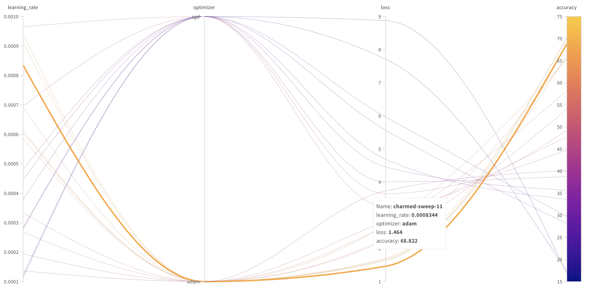
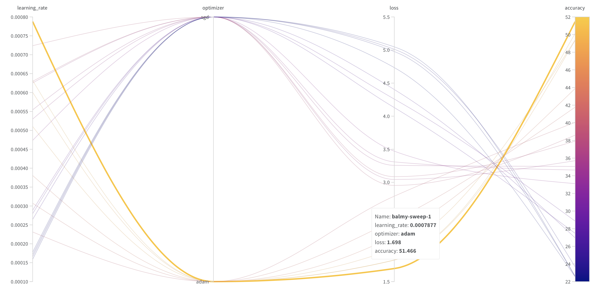

# Traffic-Sign-Recognition-Using-Transfer-Learning

Final Project for DS-UA 301 Advanced Topics in Data Science

### Team members
Lauren Kwon and Michelle Espinoza

## Project Description

Autonomous vehicles have recently emerged as a rising trend in artificial intelligence (AI) and deep learning (DL). Major car manufacturers such as Tesla, Toyota, Mercedes-Benz, and Ford are investing heavily in the development of self-driving car technology. Autonomous vehicles must understand and operate according to traffic rules. Consequently, cars must comprehend road markings and make appropriate decisions. Recognizing the importance of this technology, we attempt to classify traffic signs in this project.

One challenge faced in this project is the limited number of images per class in the dataset, which could lead to poor model performance. To overcome this issue, transfer learning will be employed. The approach involves using four pre-trained image classification models - ResNet-50, LeNet-5, DenseNet-161, and MobileNet v2 - to initialize the training and classification of the German Traffic Sign Recognition Benchmark dataset from Kaggle. Optimal learning rates are found using Weights & Biases (wandb.ai).

Goal: Identifying the best model architecture and optimal learning rate when applying transfer learning for traffic sign recognition. 

## Model Architecture

The pre-trained model is first loaded, ensuring that the weights of all layers are frozen to preserve the original learned features. A new fully connected layer is then appended to the model, replacing the original one, with an output dimension of 43 corresponding to the number of traffic sign classes. The weights for newly added fully connected layer are initialized and the bias terms of the new layer are initialized to zero. During training, only the weights of the new fully connected layer will be updated, allowing the model to fine-tune its output for traffic sign classification while leveraging the knowledge encoded in the pre-trained architecture.

## Results

### Learning Rate, Optimizer, Validation loss, Validation Accuracy

The learning rate value with the minimal validation loss is selected for each model.

- ResNet-50
  + learning rate: 0.0008861 
  + optimizer: adam
  + loss: 1.734
  + accuracy: 57.256

- LeNet-5
  + learning rate: 0.0008741 
  + optimizer: adam
  + loss: 2.153
  + accuracy: 41.992

- DenseNet-161
  + learning rate: 0.0008344 
  + optimizer: adam
  + loss: 1.464
  + accuracy: 68.822

- MobileNet v2
  + learning rate: 0.0007877 
  + optimizer: adam
  + loss: 1.698
  + accuracy: 51.466

### Model Performance

The performance of the model is measured in terms of accuracy on the unseen test set.

- ResNet-50
  + Accuracy: 95.60%
  + Loss: 0.2084
  + F1 Score: 0.9317

- LeNet-5
  + Accuracy: 95.24%
  + Loss: 0.2068
  + F1 Score: 0.9357

- DenseNet-161
  + Accuracy: 95.97%
  + Loss: 0.1757
  + F1 Score: 0.9382

- MobileNet v2
  + Accuracy: 95.45%
  + Loss: 0.2372
  + F1 Score: 0.9208

### Insights

1. Among the four models, DenseNet-161 achieved the highest accuracy (95.97%), the lowest loss (0.1757), and highest f1-score (0.9382). This implies that DenseNet-161 is more effective at correctly identifying traffic signs in the given dataset, making fewer misclassifications compared to the other models, and achieving good balance of precision and recall.

2. The results demonstrate the potential of transfer learning in scenarios with limited data. All models managed to learn traffic sign classifications to some extent, leveraging their pre-trained weights. Although the differences in performance metrics among the models are quite small, not all architectures are equally effective for this task, and the choice of architecture matters.

3. Different architectures have different trade-offs in terms of computational efficiency, memory usage, and ease of implementation. For example, MobileNet v2, despite having slightly lower performance metrics, might still be the best choice for a resource-constrained environment due to its design for efficiency, whereas DenseNet-161 required the longest training time to get the highest accuracy.

## Conclusion

In our project, we leveraged the power of transfer learning to classify traffic signs. Through the use of pre-trained models - ResNet-50, LeNet-5, DenseNet-161, and MobileNet v2 - we were able to achieve impressive performance, despite the limited number of images per class in our dataset.

Each of the models showcased their strengths in the experiment, with DenseNet-161 achieving the highest overall performance in terms of accuracy, loss, and F1 score. However, it is important to note that model selection is not solely dependent on performance metrics. Factors such as computational efficiency, memory usage, and suitability for specific deployment environments also play a vital role in the selection process. For instance, in a resource-constrained environment, MobileNet v2, despite its slightly lower performance, could be the preferred choice due to its efficiency in design.

The results of our work highlight the potential of transfer learning for tasks with limited data availability, and underscore the importance of choosing the right architecture when applying this technique. As advancements in autonomous vehicle technology continue, we believe our findings will contribute positively to the field, particularly in the area of traffic sign recognition.

## References

- [German Traffic Sign Recognition Benchmark (GTSRB) Dataset from Kaggle](https://www.kaggle.com/datasets/meowmeowmeowmeowmeow/gtsrb-german-traffic-sign)
- He, K., Zhang, X., Ren, S., & Sun, J. (2016). Deep residual learning for image recognition. In Proceedings of the IEEE conference on computer vision and pattern recognition (pp. 770-778).
- LeCun, Y., Bottou, L., Bengio, Y., & Haffner, P. (1998). Gradient-based learning applied to document recognition. Proceedings of the IEEE, 86(11), 2278-2324.
- Huang, G., Liu, Z., Van Der Maaten, L., & Weinberger, K. Q. (2017). Densely connected convolutional networks. In Proceedings of the IEEE conference on computer vision and pattern recognition (pp. 4700-4708).
- Sandler, M., Howard, A., Zhu, M., Zhmoginov, A., & Chen, L. C. (2018). Mobilenetv2: Inverted residuals and linear bottlenecks. In Proceedings of the IEEE conference on computer vision and pattern recognition (pp. 4510-4520).
