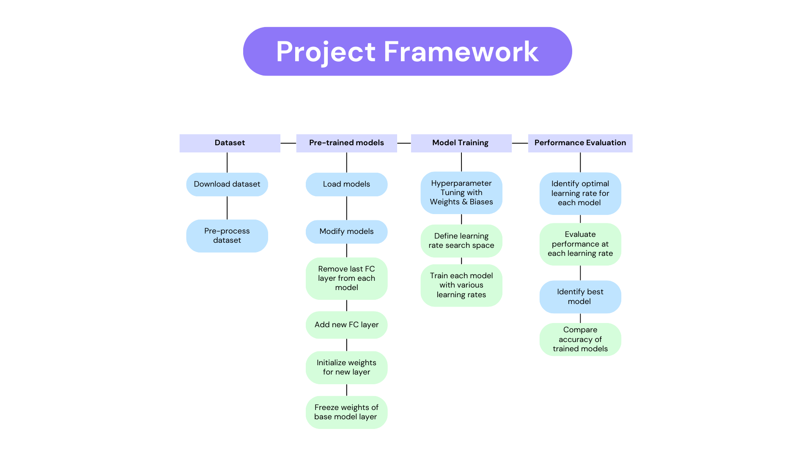
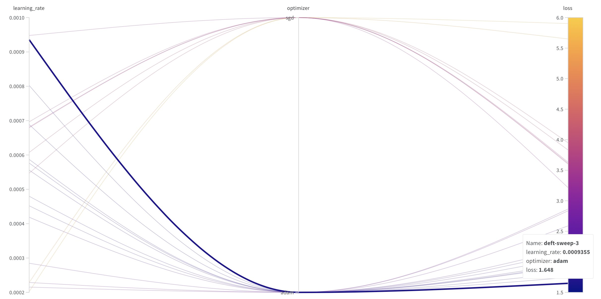
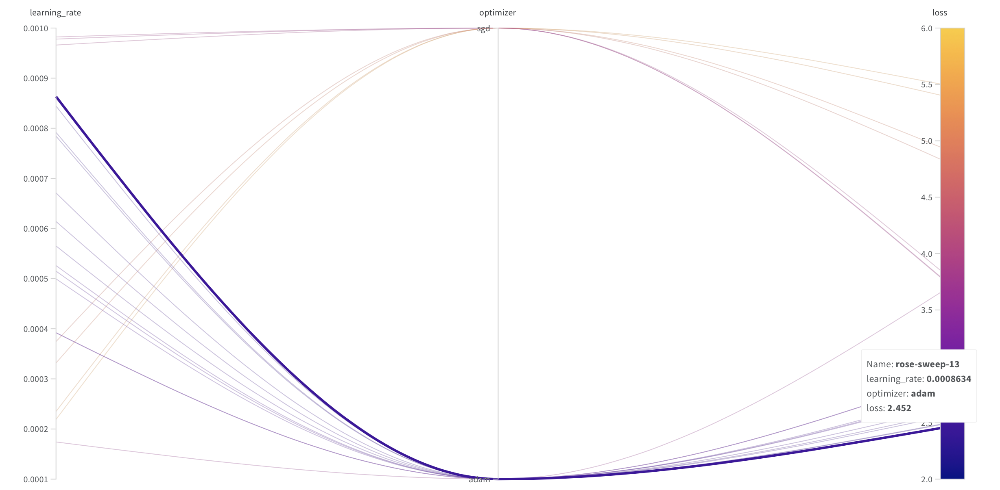

# Traffic-Sign-Recognition-Using-Transfer-Learning

Final Project for DS-UA 301 Advanced Topics in Data Science

### Team members
Lauren Kwon and Michelle Espinoza

## Project Description

Autonomous vehicles have recently emerged as a rising trend in artificial intelligence (AI) and deep learning (DL). Major car manufacturers such as Tesla, Toyota, Mercedes-Benz, and Ford are investing heavily in the development of self-driving car technology. Autonomous vehicles must understand and operate according to traffic rules. Consequently, cars must comprehend road markings and make appropriate decisions. Recognizing the importance of this technology, we attempt to classify traffic signs in this project.

One challenge faced in this project is the limited number of images per class in the dataset, which could lead to poor model performance. To overcome this issue, transfer learning will be employed. The approach involves using three image classification models - ResNet-50, VGG-16, and LeNet-5 - pretrained on ImageNet, CIFAR100, and MNIST datasets respectively, to initialize the training and classification of the German Traffic Sign Recognition Benchmark dataset from Kaggle.

Goal: Identifying the best model architecture and optimal learning rate when applying transfer learning for traffic sign recognition. 

## Model Architecture
The fully connected layer at the end of each pre-trained model will be removed, and a new fully connected layer with output dimensions corresponding to the number of classes in the traffic sign dataset will be added. The weights of the new fully connected layer will be randomized, while the weights from the pre-trained model will be frozen. The model will be trained to update the weights of the new fully connected layer. Wandb.ai will be used to find the learning rate with minimal loss for each model.

## Results

### Learning Rate

- ResNet-50

- VGG-16

- LeNet-5

### Model Performance

- ResNet-50
- VGG-16
- LeNet-5

### Insights

## Conclusion

## Links
- [Google Colab Notebook](https://colab.research.google.com/drive/1jHdlSlW3YWTQ49cYC6BQqhkzopzX8Qf2#scrollTo=WchzWWUlW4xM)
- [Presentation Slides](https://docs.google.com/presentation/d/1pMk51fNKynncxjOoo2xaL5i9ExKMJfYOiIYm0Qx7HIU/edit#slide=id.g22d81cb8e33_0_50)

## References

- [German Traffic Sign Recognition Benchmark (GTSRB) Dataset from Kaggle](https://www.kaggle.com/datasets/meowmeowmeowmeowmeow/gtsrb-german-traffic-sign)
- [Traffic sign recognition with multi-scale Convolutional Networks (Sermanet and LeCun, 2011)](https://ieeexplore.ieee.org/document/6033589)
